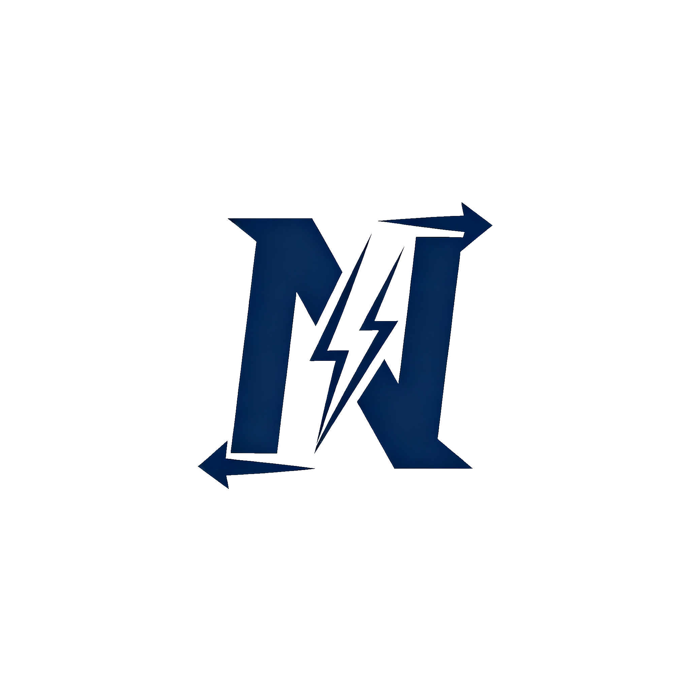

# NitroSocks

---

> A protocol designed to provide end-to-end security verification under untrusted TLS, rendering man-in-the-middle interception meaningless or prohibitively costly.

## About NitroSocks

**[简体中文](./docs/zhcn.md) | [English](./docs/enus.md)**
