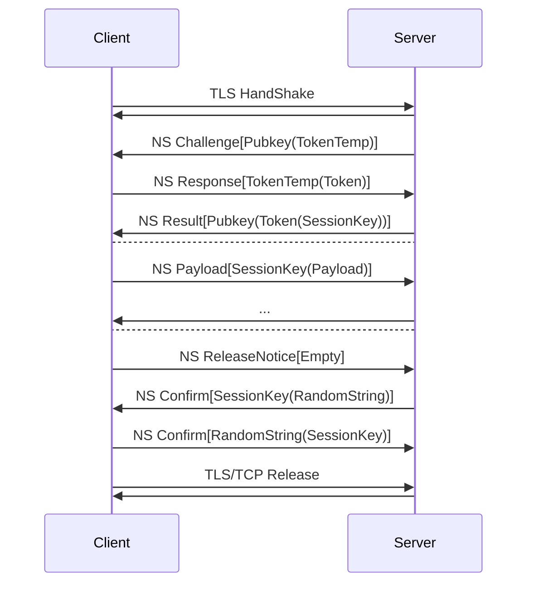

# NitroSocks

A protocol designed to provide end-to-end security verification under untrusted TLS, rendering man-in-the-middle interception meaningless or prohibitively costly.

## Protocol Flow

## Data Packet Structure

Each NitroSocks data packet adheres to the fixed format: 2 bytes of random meaningless content + variable-size payload. The 2-byte random content serves as obfuscation to avoid packet pattern recognition by intermediate devices.

## Core Features

1. End-to-End Security over Untrusted TLS: Establishes a secure channel independent of TLS trustworthiness, ensuring core data confidentiality even if TLS is compromised.
2. High MITM Attack Cost: Multi-layered authentication (Challenge → Response → Result) and session-key-encrypted payloads make interception and decryption technically difficult and computationally expensive.
3. Dual-Factor Authentication: Requires clients to possess both a private key and a token to access server resources, providing enhanced security through multiple authentication factors.
4. Persistent Connection Optimization: Particularly suitable for long-lived connections that are not frequently released, such as VPN tunnels, maintaining secure sessions over extended periods.
5. Symmetric Key Encryption: Both token and tokentemp utilize symmetric encryption algorithms, ensuring efficient and secure key exchange and validation processes.
6. Payload Obfuscation: 2-byte random prefix hides the real payload structure, preventing traffic analysis and pattern-based attacks.
7. Secure Session Termination: Dual-confirmation mechanism with RandomString ensures legitimate session closure and avoids malicious termination requests.

## Design Motivation

The primary motivation of NitroSocks is to address the security limitations of traditional TLS in untrusted network environments. Traditional TLS relies heavily on trusted certificate authorities, which are vulnerable to forgery or compromise, exposing data to man-in-the-middle attacks. NitroSocks introduces a separate authentication and encryption layer on top of TLS, ensuring that even if the TLS layer is untrusted, intercepted data remains unreadable. By adding payload obfuscation, multi-step key negotiation, and dual-factor authentication requiring both private keys and tokens, it raises the technical threshold and computational cost of attacks to a level where interception becomes impractical. The protocol is particularly optimized for persistent connections like VPNs, where long-term security is paramount, and employs symmetric encryption for both tokens to balance security and performance.