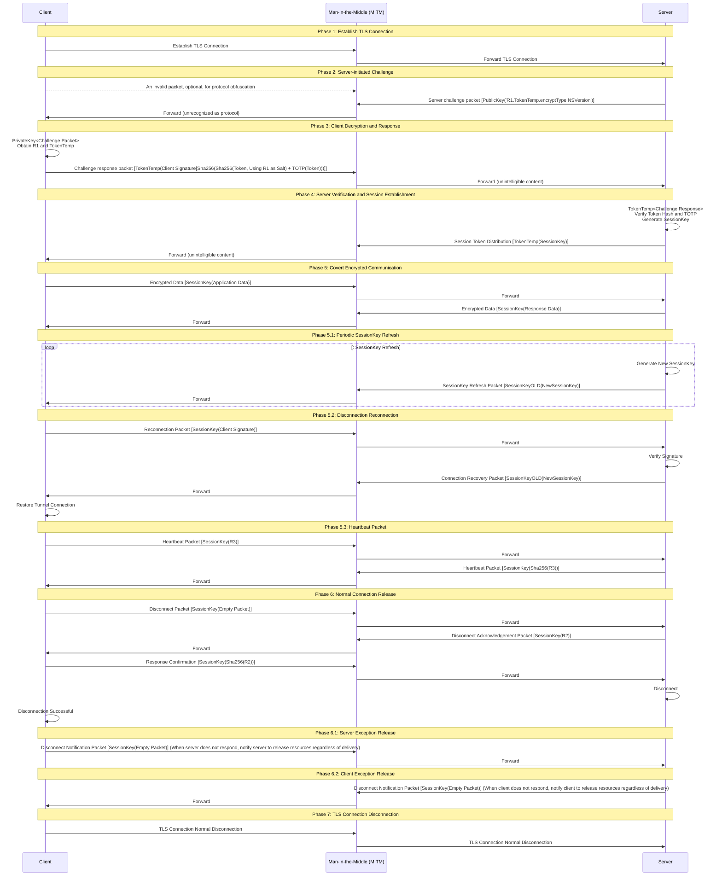

# NitroSocks V1

A Layer 7 tunnel protocol designed to provide high-security, anti-Man-in-the-Middle (MITM) attacks, and end-to-end verification over untrusted TLS environments based on TCP-TLS, making interception by middlemen ineffective or extremely difficult to crack. It enforces `AES-128-GCM/AES-256-GCM` encrypted packets to provide post-quantum security within observable future.

## Features

- **High Security**: Provides end-to-end verification in untrusted TLS environments
- **Anti-Man-in-the-Middle Attacks**: Makes MITM attacks ineffective or extremely difficult to crack
- **Post-Quantum Security**: Enforces AES-128-GCM/AES-256-GCM encryption
- **Protocol Obfuscation**: Supports invalid packets for protocol obfuscation, enhancing stealth
- **Session Management**: Supports periodic SessionKey refresh and reconnection
- **Heartbeat Keep-alive**: Built-in heartbeat mechanism to maintain connection activity
- **Graceful Shutdown**: Supports normal connection release and exception handling

## Protocol Flow

For explanatory purposes, we define `abc[]` as abc payload content, `abc()` as encryption using abc, and `abc<>` as decryption using `abc`. The `Man-in-the-Middle` referred to here represents a potential TLS traffic **hijacking node** that may exist in practice, **NOT** a normal network role in the connection.

## Field Description

| Field          | Type                | Description         |
| -------------- | ------------------- | ------------------- |
| PublicKey      | String              | Server Public Key   |
| PrivateKey     | String              | Client Private Key  |
| Token          | String              | Client Login Token  |
| TokenTemp      | String              | Handshake Temp Token|
| SessionKey     | String              | Session Key         |
| SessionKeyOLD  | String              | Old Session Key     |
| SessionKeyNew  | String              | New Session Key     |
| R1             | String              | Random Number 1     |
| R2             | String              | Random Number 2     |
| R3             | String              | Random Number 3     |
| Sha256         | -                   | SHA256              |
| encryptType    | DWORD_INT32(4 bytes)| Encryption Type     |
| NSVersion      | DWORD_INT32(4 bytes)| NitroSocks Version  |

## Storage Requirements

### Long-term Storage

> **(Please ensure the security of long-term stored data, such as using keychain to store keys)**

1. **Server Public Key (PublicKey)**

   The server public key is used during the **handshake phase** for **asymmetric encryption/decryption (RSA2048)** with the client. This key is statically stored. When building your application, it is recommended that you **regularly update the key** to maintain application security.

2. **Client Private Key (PrivateKey)**

   The client private key is used during the **handshake phase** for **asymmetric encryption/decryption (RSA2048)** with the server. This key is statically stored. Please ensure key security and regularly update the key to maintain application security.

3. **Client Login Token**

   The client login token is used during the **handshake phase** for **symmetric encryption/decryption (AES-128-GCM/AES-256-GCM)** with the server. We recommend dynamic management of this token, which grants the **Client** permission to access **Server resources**.

### Temporary Storage in RAM

1. **Handshake Phase Temporary Token (TokenTemp)**

   The handshake phase temporary token is used during the **handshake phase** for **symmetric encryption/decryption (AES-128-GCM/AES-256-GCM)** with the server. This token is temporarily stored and becomes invalid upon handshake completion.

2. **Session Key (SessionKey)**

   The session key is used during the **session phase** for **symmetric encryption/decryption (AES-128-GCM/AES-256-GCM)** with the server. This key is temporarily stored and becomes invalid when the session terminates normally.

3. **Old Session Key (SessionKeyOLD)**

   The old session key is used during the **session phase** for **key refreshing** with the server. This key is the "current session key" and becomes void after refresh.

4. **New Session Key (SessionKeyNew)**

   The new session key is used during the **session phase** for **key refreshing** with the server. This key is the "new session key" that replaces the "current session key". When the server sends a key refresh packet, **all subsequent packets** will use this key.

## Process Details

Here we define `C` as client, `M` as potential man-in-the-middle, and `S` as server.

### Handshake Phase

#### Phase 1: Establish TLS Connection

- As this is not something NitroSocks should concern itself with, we omit this step.

#### Phase 2: Server-initiated Challenge

- **C→M** (Optional): Protocol obfuscation packet [random invalid data]
- **S→M**: Server challenge packet [PublicKey(`'R1.TokenTemp.encryptType.NSVersion'`)], where:
  - R1: Random number generated by server (please use cryptographically secure algorithms to generate)
  - TokenTemp: Temporary session token
  - encryptType: Encryption type identifier
  - NSVersion: Protocol version number
- **M→C**: Man-in-the-middle forwards challenge packet (unable to identify protocol content)

#### Phase 3: Client Decryption and Response

- **C**: Uses PrivateKey to decrypt challenge packet, obtaining R1, TokenTemp, encryptType, NSVersion
- **C→M**: Challenge response packet [TokenTemp(Client Signature)], signature content:
  - Sha256(Sha256(Token + R1) + TOTP(Token))
    > Note: If the server cannot verify the signature, there are two cases: 1. If the server has received a confusion packet before initiating the Challenge, it will directly consider that the client cannot prove possession of the token, and will directly release the connection. 2. If the client did not send a confusion packet previously, if the server cannot verify the signature, it will consider this client packet invalid (treated as a confusion packet), and DROP the packet. At this time, the behavior is "response timeout". If another such packet is sent at this time, it will be treated as a normal challenge response packet.
- **M→S**: Man-in-the-middle forwards response packet (unintelligible content)

#### Phase 4: Server Verification and Session Establishment

- **S**: Uses TokenTemp to decrypt response packet and verify signature:
  - Calculate expected Sha256(Sha256(Token + R1) + TOTP(Token))
  - Compare with client signature
  - Verify TOTP time window
- **S**: Generates SessionKey session key
- **S→M**: Session establishment packet [TokenTemp(SessionKey)]
- **M→C**: Man-in-the-middle forwards session establishment packet

### Session Phase

#### Phase 5: Covert Encrypted Communication

- **C→M**: Application data packet [SessionKey(actual application data)]
- **M→S**: Forward encrypted data
- **S→M**: Response data packet [SessionKey(server response data)]
- **M→C**: Forward encrypted response

#### Phase 5.1: Periodic SessionKey Refresh

- **S**: Generates new SessionKeyNew
- **S→M**: Key update packet [SessionKeyOLD(NewSessionKey)]
- **M→C**: Forward key update packet
- **C**: Uses SessionKeyOLD to decrypt and obtain NewSessionKey
- Subsequent communication uses NewSessionKey for encryption

#### Phase 5.2: Disconnection Reconnection

- **C→M**: Reconnection request packet [SessionKey(client signature)]
- **M→S**: Forward reconnection request
- **S**: Verify client signature validity
- **S→M**: Reconnection response packet [SessionKeyOLD(NewSessionKey)]
- **M→C**: Forward reconnection response
- **C**: Restore tunnel connection, use NewSessionKey

#### Phase 5.3: Heartbeat Keep-alive

- **C→M**: Heartbeat request packet [SessionKey(R3)], R3 is a random number (please use cryptographically secure algorithms to generate)
- **M→S**: Forward heartbeat request
- **S→M**: Heartbeat response packet [SessionKey(Sha256(R3))]
- **M→C**: Forward heartbeat response
- **C**: Verify correctness of Sha256(R3)

### Connection Release Phase

#### Phase 6: Normal Connection Release

- **C→M**: Disconnection request packet [SessionKey(empty packet)]
- **M→S**: Forward disconnection request
- **S→M**: Disconnection acknowledgment packet [SessionKey(R2)], R2 is a random number (please use cryptographically secure algorithms to generate)
- **M→C**: Forward disconnection acknowledgment
- **C→M**: Final confirmation packet [SessionKey(Sha256(R2))]
- **M→S**: Forward final confirmation
- **S**: Clean up session resources, disconnect
- **C**: Clean up session resources, disconnection successful

#### Phase 6.1: Server Exception Release

- **C→M**: Force disconnection notification packet [SessionKey(empty packet)]
- **M→S**: Forward disconnection notification
- **S**: Force release connection resources

#### Phase 6.2: Client Exception Release

- **S→M**: Force disconnection notification packet [SessionKey(empty packet)]
- **M→C**: Forward disconnection notification
- **C**: Force release connection resources

#### Phase 7: TLS Connection Disconnection

- **C→M**: Send TLS close_notify alert, close TLS connection
- **M→S**: Forward TLS closure request, close TLS connection

## Packet Description

Note: The description here only applies to **raw packets** before **TLS encryption**

(Document still under construction, please be patient...)