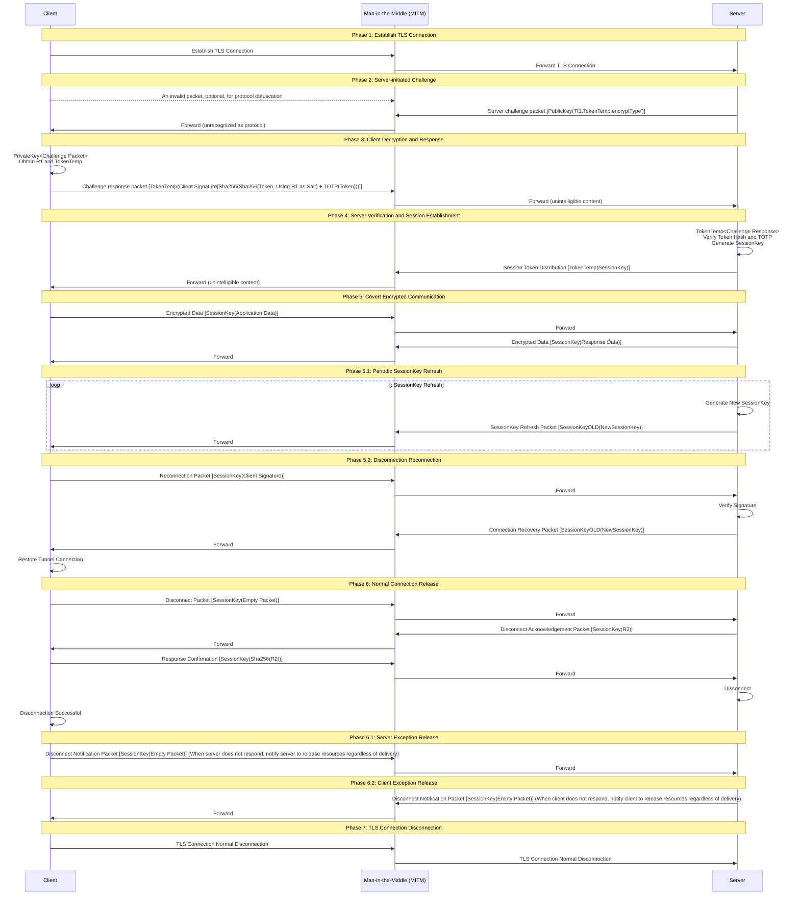

# NitroSocks

A Layer 7 tunnel protocol designed to provide high-security, anti-Man-in-the-Middle (MITM) attacks, and end-to-end verification over untrusted TLS environments based on TCP-TLS, making interception by middlemen ineffective or extremely difficult to crack. It enforces `AES-128-GCM/AES-256-GCM` encrypted packets to provide post-quantum security within observable future.

## Protocol Flow

For explanatory purposes, we define `abc[]` as abc payload content, `abc()` as encryption using abc, and `abc<>` as decryption using `abc`. The `Man-in-the-Middle` referred to here represents a potential TLS hijacking node that may exist in practice, **NOT** a normal network role in the connection.

