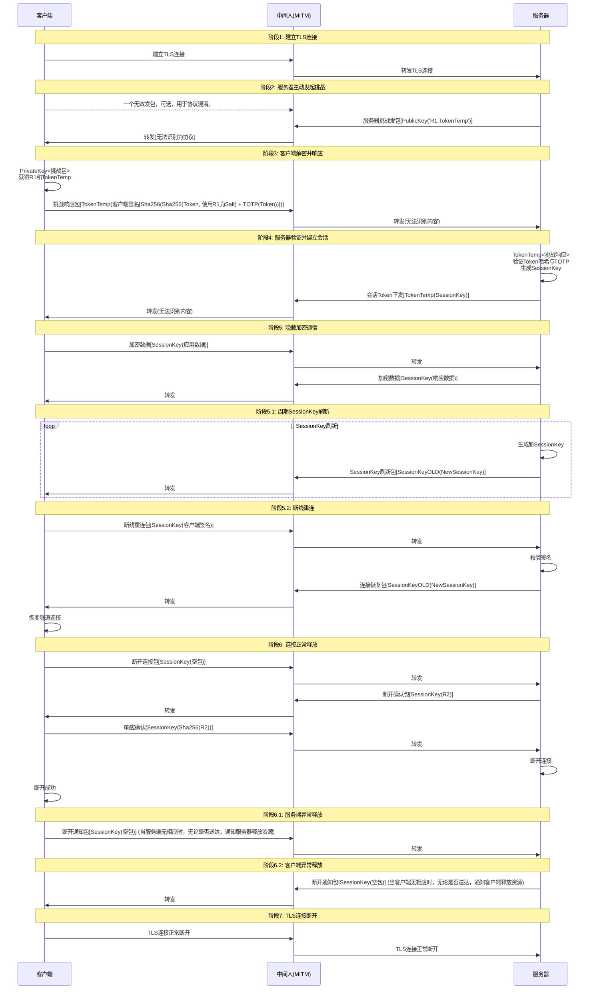

# NitroSocks

一个旨在在不可信TLS环境下提供高安全性的端到端验证的隧道协议，使得中间人截获无效或破解难度过高。

## 协议流程

为了便于解释，于是，我们规定`abc[]`表示abc的负载(Payload)内容，`abc()`表示使用abc加密，`abc<>`表示使用`abc`解密。此处的`中间人`是假设实际中可能存在的TLS劫持节点，**并非**正常连接中的网络角色。

```mermaid
sequenceDiagram
    participant C as 客户端
    participant M as 中间人(MITM)
    participant S as 服务器

    Note over C,S: 阶段1: 建立TLS连接
    C->>M: 建立TLS连接
    M->>S: 转发TLS连接
    
    Note over C,S: 阶段2: 服务器主动发起挑战
    C-->>M: 一个无效发包，可选，用于协议混淆。
    S->>M: 服务器挑战发包[PublicKey('R1.TokenTemp')]
    M->>C: 转发(无法识别为协议)
    
    Note over C,S: 阶段3: 客户端解密并响应
    C->>C: PrivateKey<挑战包><br>获得R1和TokenTemp
    C->>M: 挑战响应包[TokenTemp(客户端签名[Sha256(Sha256(Token, 使用R1为Salt) + TOTP(Token))])]
    M->>S: 转发(无法识别内容)
    
    Note over C,S: 阶段4: 服务器验证并建立会话
    S->>S: TokenTemp<挑战响应><br>验证Token哈希与TOTP<br>生成SessionKey
    S->>M: 会话Token下发[TokenTemp(SessionKey)]
    M->>C: 转发(无法识别内容)
    
    Note over C,S: 阶段5: 隐蔽加密通信
    C->>M: 加密数据[SessionKey(应用数据)]
    M->>S: 转发
    S->>M: 加密数据[SessionKey(响应数据)]
    M->>C: 转发

    Note over C,S: 阶段5.1: 周期SessionKey刷新
    loop: SessionKey刷新
    S->>S: 生成新SessionKey
    S->>M: SessionKey刷新包[SessionKeyOLD(NewSessionKey)]
    M->>C: 转发
    End

    Note over C,S: 阶段5.2: 断线重连
    C->>M: 断线重连包[SessionKey(客户端签名)]
    M->>S: 转发
    S->>S: 校验签名
    S->>M: 连接恢复包[SessionKeyOLD(NewSessionKey)]
    M->>C: 转发
    C->>C: 恢复隧道连接

    Note over C,S: 阶段6: 连接正常释放
    C->>M: 断开连接包[SessionKey(空包)]
    M->>S: 转发
    S->>M: 断开确认包[SessionKey(R2)]
    M->>C: 转发
    C->>M: 响应确认[SessionKey(Sha256(R2))]
    M->>S: 转发
    S->>S: 断开连接
    C->>C: 断开成功

    Note over C,S: 阶段6.1: 服务端异常释放
    C->>M: 断开通知包[SessionKey(空包)] (当服务端无相应时，无论是否送达，通知服务器释放资源)
    M->>S: 转发
    
    Note over C,S: 阶段6.2: 客户端异常释放
    S->>M: 断开通知包[SessionKey(空包)] (当客户端无相应时，无论是否送达，通知客户端释放资源)
    M->>C: 转发


    Note over C,S: 阶段7: TLS连接断开
    C->>M: TLS连接正常断开
    M->>S: TLS连接正常断开


    

  
```
