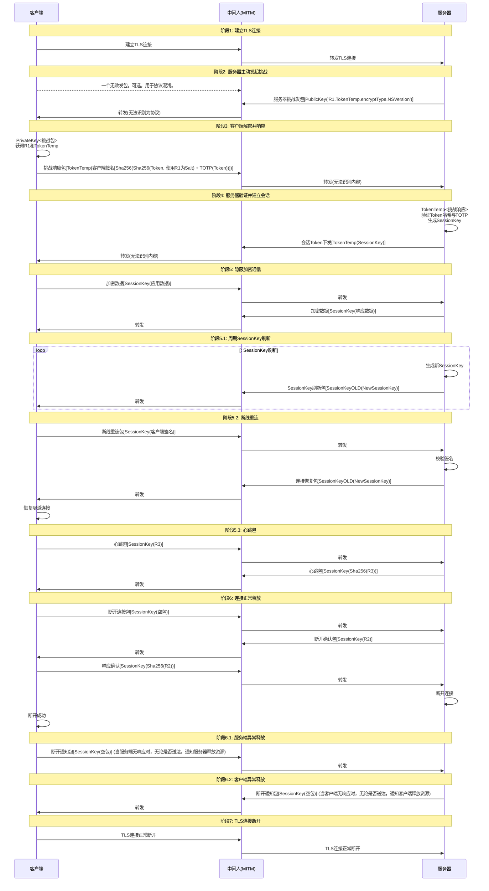

# NitroSocks V1

一个旨在在不可信 TLS 环境下，基于 TCP-TLS 提供高安全性的抗中间人攻击，端到端验证的`L7`隧道协议，使得中间人截获无效或破解难度过高，强制`AES-128-GCM/AES-256-GCM` 加密数据包以在可观测未来内提供抗量子的安全性。

## 特性

- **高安全性**：在不可信 `TLS` 环境下提供端到端验证
- **抗中间人攻击**：使 `MITM` 攻击无效或极难破解
- **抗量子安全**：强制使用 `AES-128-GCM/AES-256-GCM` 加密
- **协议混淆**：支持无效发包用于协议混淆，增强隐蔽性
- **会话管理**：支持周期性 `SessionKey` 刷新和断线重连
- **心跳保活**：内置心跳包机制维持连接活性
- **优雅关闭**：支持连接的正常释放和异常处理

## 协议流程

为了便于解释，于是，我们规定`abc[]`表示 abc 的负载(Payload)内容，`abc()`表示使用 abc 加密，`abc<>`表示使用`abc`解密。此处的`中间人`是假设实际中可能存在的 TLS流量 **劫持节点**，**并非**正常连接中的网络角色。

## 字段说明

| 字段           | 类型                | 说明            |
| -------------- | ------------------- | --------------- |
| PublicKey      | String              | 服务器公钥      |
| PrivateKey     | String              | 客户端私钥      |
| Token          | String              | 客户端登录令牌  |
| TokenTemp      | String              | 握手时临时令牌  |
| SessionKey     | String              | 会话密钥        |
| SessionKeyOLD  | String              | 旧会话密钥      |
| SesssionKeyNew | String              | 新会话密钥      |
| R1             | String              | 随机数 1        |
| R2             | String              | 随机数 2        |
| R3             | String              | 随机数 3        |
| Sha256         | -                   | SHA256          |
| encryptType    | DWORD_INT32(4 字节) | 加密类型        |
| NSVersion      | DWORD_INT32(4 字节) | NitroSocks 版本 |

## 存储要求

### 长期存储

> **（请务必保持长期存储的数据安全，例如使用钥匙环存储密钥）**

1. **服务器公钥(PublicKey)**

   服务器公钥用于在 **握手阶段** 与客户端进行 **非对称加密解密(RSA2048)** 时使用，该密钥为静态存储，在构建您的应用时建议您 **定期进行密钥更新**，以保持您的应用安全。

2. **客户端私钥(PrivateKey)**

   客户端私钥用于在 **握手阶段** 与服务器进行 **非对称加密解密(RSA2048)** 时使用，该密钥为静态存储，请保证密钥安全，并定期进行密钥更新，以保持您的应用安全。

3. **客户端登录令牌**

   客户端登录令牌用于在 **握手阶段** 与服务器进行 **对称加密解密(AES-128-GCM/AES-256-GCM)** 时使用，我们建议您对该令牌进行动态管理，它赋予了**Client**访问**Server 资源**的权限。

### RAM 中临时存储

1. **握手阶段临时令牌(TokenTemp)**

   握手阶段临时令牌用于在 **握手阶段** 与服务器进行 **对称加密解密(AES-128-GCM/AES-256-GCM)** 时使用，该令牌为临时存储，握手完成时即失效。

2. **会话密钥(SessionKey)**

   会话密钥用于在 **会话阶段** 与服务器进行 **对称加密解密(AES-128-GCM/AES-256-GCM)** 时使用，该密钥为临时存储，会话正常终止时即失效。

3. **旧会话密钥(SessionKeyOLD)**

   旧会话密钥用于在 **会话阶段** 与服务器进行 **密钥刷新** 时使用，该密钥是”现在的会话密钥“，刷新完后即作废。

4. **新会话密钥(SessionKeyNew)**

   新会话密钥用于在 **会话阶段** 与服务器进行 **密钥刷新** 时使用，该密钥是”新的会话密钥“，替代”现在的会话密钥“，当服务器发送密钥刷新包时，之后的 **所有发包**均使用该密钥。

## 流程详解

此处我们约定`C`表示客户端，`M`表示可能的中间人存在，`S`表示服务器

### 握手阶段

#### 阶段 1：建立 TLS 连接

- 由于这不是 NitroSocks 该关心的内容，因此我们省略了该步骤

#### 阶段 2：服务器主动发起挑战

- **C→M**（可选）：协议混淆包[随机无效数据]
- **S→M**：服务器挑战包[PublicKey(`'R1.TokenTemp.encryptType.NSVersion'`)]，其中：
  - R1：服务器生成的随机数（请使用密码学安全的算法生成）
  - TokenTemp：临时会话令牌
  - encryptType：加密类型标识
  - NSVersion：协议版本号
- **M→C**：中间人转发挑战包（无法识别协议内容）

#### 阶段 3：客户端解密并响应

- **C**：使用 PrivateKey 解密挑战包，获得 R1、TokenTemp、encryptType、NSVersion
- **C→M**：挑战响应包[TokenTemp(客户端签名)]，签名内容为：
  - Sha256(Sha256(Token + R1) + TOTP(Token))
    > 注：如果服务器无法验证签名，则有两种情况：1. 如果发起Challenge之前，服务器已经接收了一个混淆包，那么则直接认为客户端无法证明自己持有令牌，会直接释放连接。2. 先前客户端没有发送混淆包，那么如果服务器无法验证签名，那么会认为客户端这次发包无效（被视为混淆包），将DROP该包，此时的表现为“响应超时”。此时如果再发送一个该包，则会被视为是一个正常的挑战响应包。
- **M→S**：中间人转发响应包（无法识别内容）

#### 阶段 4：服务器验证并建立会话

- **S**：使用 TokenTemp 解密响应包，验证签名：
  - 计算期望的 Sha256(Sha256(Token + R1) + TOTP(Token))
  - 与客户端签名比对
  - 验证 TOTP 时间窗口
- **S**：生成 SessionKey 会话密钥
- **S→M**：会话建立包[TokenTemp(SessionKey)]
- **M→C**：中间人转发会话建立包

### 会话阶段

#### 阶段 5：隐蔽加密通信

- **C→M**：应用数据包[SessionKey(实际应用数据)]
- **M→S**：转发加密数据
- **S→M**：响应数据包[SessionKey(服务器响应数据)]
- **M→C**：转发加密响应

#### 阶段 5.1：周期 SessionKey 刷新

- **S**：生成新的 SessionKeyNew
- **S→M**：密钥更新包[SessionKeyOLD(NewSessionKey)]
- **M→C**：转发密钥更新包
- **C**：使用 SessionKeyOLD 解密获得 NewSessionKey
- 后续通信使用 NewSessionKey 加密

#### 阶段 5.2：断线重连

- **C→M**：重连请求包[SessionKey(客户端签名)]
- **M→S**：转发重连请求
- **S**：验证客户端签名有效性
- **S→M**：重连响应包[SessionKeyOLD(NewSessionKey)]
- **M→C**：转发重连响应
- **C**：恢复隧道连接，使用 NewSessionKey

#### 阶段 5.3：心跳保活

- **C→M**：心跳请求包[SessionKey(R3)]，R3 为随机数（请使用密码学安全的算法生成）
- **M→S**：转发心跳请求
- **S→M**：心跳响应包[SessionKey(Sha256(R3))]
- **M→C**：转发心跳响应
- **C**：验证 Sha256(R3)正确性

### 连接释放阶段

#### 阶段 6：连接正常释放

- **C→M**：断开请求包[SessionKey(空包)]
- **M→S**：转发断开请求
- **S→M**：断开确认包[SessionKey(R2)]，R2 为随机数（请使用密码学安全的算法生成）
- **M→C**：转发断开确认
- **C→M**：最终确认包[SessionKey(Sha256(R2))]
- **M→S**：转发最终确认
- **S**：清理会话资源，断开连接
- **C**：清理会话资源，断开成功

#### 阶段 6.1：服务端异常释放

- **C→M**：强制断开通知包[SessionKey(空包)]
- **M→S**：转发断开通知
- **S**：强制释放连接资源

#### 阶段 6.2：客户端异常释放

- **S→M**：强制断开通知包[SessionKey(空包)]
- **M→C**：转发断开通知
- **C**：强制释放连接资源

#### 阶段 7：TLS 连接断开

- **C→M**：发送 TLS close_notify 告警，关闭 TLS 连接
- **M→S**：转发 TLS 关闭请求，关闭 TLS 连接

## 数据包说明

注：此处说明仅对于进行 **TLS加密前** 的 **原始数据包** 进行说明

（文档仍然在施工，请稍安勿躁......）
