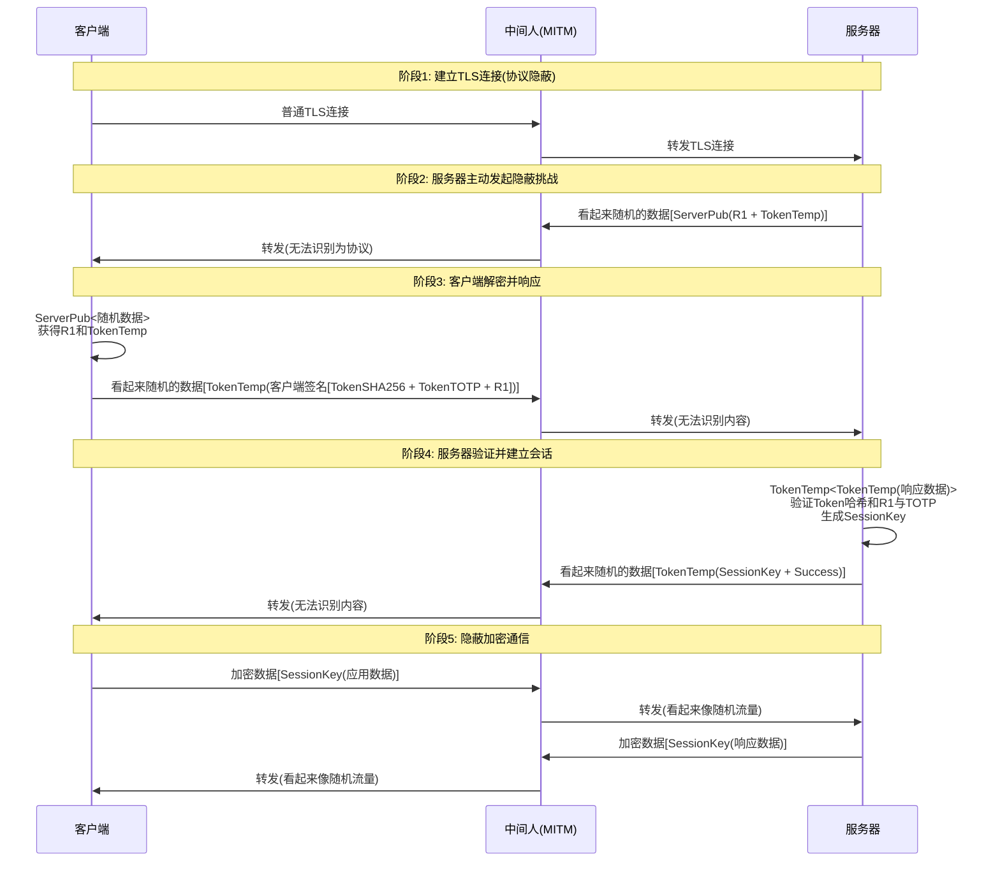

# NitroSocks

一个旨在在不可信TLS环境下提供高安全性的端到端验证的隧道协议，使得中间人截获无效或破解难度过高。

现在您在**ZH_CN**|[**EN_US**](./README.md)

## 协议流程

我们规定`[]`表示负载，`()`表示使用...加密，`<>`表示解密。

```mermaid
sequenceDiagram
    participant C as 客户端
    participant M as 中间人(MITM)
    participant S as 服务器

    Note over C,S: 阶段1: 建立TLS连接(协议隐蔽)
    C->>M: 普通TLS连接
    M->>S: 转发TLS连接
    
    Note over C,S: 阶段2: 服务器主动发起隐蔽挑战
    S->>M: 看起来随机的数据[ServerPub(R1 + TokenTemp)]
    M->>C: 转发(无法识别为协议)
    
    Note over C,S: 阶段3: 客户端解密并响应
    C->>C: ServerPub<随机数据><br>获得R1和TokenTemp
    C->>M: 看起来随机的数据[TokenTemp(客户端签名[TokenSHA256 + TokenTOTP + R1])]
    M->>S: 转发(无法识别内容)
    
    Note over C,S: 阶段4: 服务器验证并建立会话
    S->>S: TokenTemp<TokenTemp(响应数据)><br>验证Token哈希和R1与TOTP<br>生成SessionKey
    S->>M: 看起来随机的数据[TokenTemp(SessionKey + Success)]
    M->>C: 转发(无法识别内容)
    
    Note over C,S: 阶段5: 隐蔽加密通信
    C->>M: 加密数据[SessionKey(应用数据)]
    M->>S: 转发(看起来像随机流量)
    S->>M: 加密数据[SessionKey(响应数据)]
    M->>C: 转发(看起来像随机流量)
  
```
