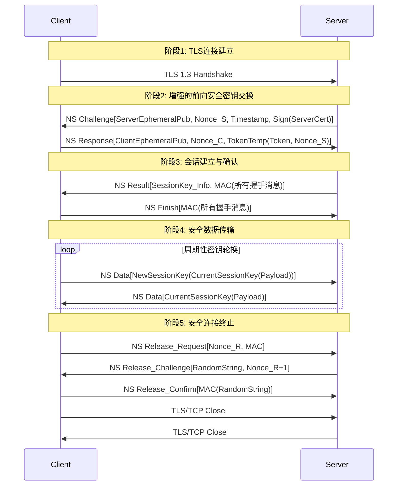

# NitroSocks

一个旨在在不可信TLS环境下提供高安全性的端到端验证的隧道协议，使得中间人截获无效或破解难度过高。

现在您在**ZH_CN**|[**EN_US**](./README.md)

## 协议流程

## 数据包结构

每个NitroSocks数据包遵循固定格式：2字节随机无意义内容 + 可变大小的有效载荷。2字节随机内容用作混淆，避免中间设备进行数据包模式识别。

## 核心特性

1. 基于不可信TLS的端到端安全：建立独立于TLS可信度的安全通道，即使TLS被攻破也能确保核心数据的机密性。
2. 高成本的MITM攻击：多层认证（挑战→响应→结果）和会话密钥加密的有效载荷使得拦截和解密在技术上困难且计算成本高昂。
3. 双因子认证：要求客户端同时持有私钥和Token才能访问服务器资源，通过多重认证因素提供增强的安全性。
4. 持久连接优化：特别适合不频繁释放的长效连接，如VPN隧道，在长时间内维持安全会话。
5. 对称密钥加密：token和tokentemp均采用对称加密算法，确保高效安全的密钥交换和验证过程。
6. 有效载荷混淆：2字节随机前缀隐藏真实有效载荷结构，防止流量分析和基于模式的攻击。
7. 安全会话终止：基于随机字符串的双重确认机制确保合法的会话关闭，避免恶意终止请求。

## 设计动机

NitroSocks的主要动机是解决传统TLS在不可信网络环境中的安全限制。传统TLS严重依赖可信证书颁发机构，这些机构容易遭受伪造或破坏，使数据暴露于中间人攻击之下。NitroSocks在TLS之上引入了独立的认证和加密层，确保即使TLS层不可信，被拦截的数据仍然不可读。通过添加有效载荷混淆、多步密钥协商以及要求同时持有私钥和Token的双因子认证，它将攻击的技术门槛和计算成本提高到使拦截变得不切实际的程度。该协议特别针对如VPN等需要长期安全的持久连接进行了优化，并对两种token均采用对称加密以平衡安全性和性能。

## 适用场景

· 长效VPN连接：特别适合需要长期保持不断开的VPN隧道
· 高安全要求的远程访问：客户端需同时持有私钥和Token才能建立连接
· 对抗中间人攻击环境：在证书可能被伪造的网络中提供额外保护层
· 持续性数据传输：需要长时间维持加密会话的应用场景
